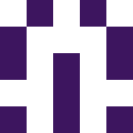
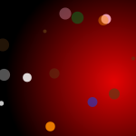

# Deterministic Avatar Generator

A lightweight, zero-dependency TypeScript package for generating unique, SVG-based identicon avatars from a seed string.

This package is designed to be extensible, allowing developers to register their own custom avatar styles and color palettes. It's perfect for user profiles, default avatars, or any application where a deterministic, visually pleasing placeholder image is needed.

## ✨ Features

  - **Extensible Styles:** Comes with several built-in styles (`block`, `gradient`, `rings`, `stripes`, `nebula`, `polygon`, `bauhaus`, `pixel`, `initials`) and allows developers to easily register their own.
  - **Extensible Palettes:** Includes a variety of built-in color palettes (`monokai`, `pride`, `muted`, `cool`, `warm`, `grayscale`) with light and dark variants, and allows for custom palette registration.
  - **Deterministic:** The same input seed will always produce the exact same avatar.
  - **Zero Dependencies:** Runs in any Node.js or browser environment without needing external packages.
  - **SVG Output:** Generates a clean, scalable SVG image as a Base64 data URI, perfect for use in `` tags.

## 🎨 Available Color Palettes

This document shows a preview for each available color palette.


### monokai

| Color | Hex Code |
|:---:|:---:|
|  | `#272822` |
|  | `#383d3b` |
|  | `#49483e` |
|  | `#75715e` |
|  | `#a59f85` |
|  | `#f92672` |
|  | `#a6e22e` |
|  | `#f4bf75` |
|  | `#66d9ef` |
|  | `#ae81ff` |


### pride

| Color | Hex Code |
|:---:|:---:|
|  | `#e40303` |
|  | `#ff8c00` |
|  | `#ffed00` |
|  | `#008026` |
|  | `#004dff` |
|  | `#750787` |
|  | `#ffffff` |
|  | `#000000` |
|  | `#613915` |
|  | `#ffafc8` |


### muted

| Color | Hex Code |
|:---:|:---:|
|  | `#5a6a62` |
|  | `#6e8179` |
|  | `#839990` |
|  | `#97b1a7` |
|  | `#acb9b1` |
|  | `#e0e0e0` |
|  | `#c7c7c7` |
|  | `#aeaeae` |
|  | `#959595` |
|  | `#7d7d7d` |


### warm

| Color | Hex Code |
|:---:|:---:|
|  | `#AF165E` |
|  | `#EE092D` |
|  | `#FF6302` |
|  | `#e96616` |
|  | `#D60457` |
|  | `#FC9F1B` |
|  | `#FFBD27` |
|  | `#FFE72B` |
|  | `#FCE77D` |
|  | `#ffca7b` |


### cool

| Color | Hex Code |
|:---:|:---:|
|  | `#09186D` |
|  | `#2B3252` |
|  | `#3D155F` |
|  | `#021c41` |
|  | `#4D4C53` |
|  | `#8AAAE5` |
|  | `#bde8f1` |
|  | `#819fa7` |
|  | `#CDC6B4` |
|  | `#dfe5f3` |


### grayscale

| Color | Hex Code |
|:---:|:---:|
|  | `#222222` |
|  | `#333333` |
|  | `#444444` |
|  | `#555555` |
|  | `#666666` |
|  | `#eeeeee` |
|  | `#dddddd` |
|  | `#cccccc` |
|  | `#bbbbbb` |
|  | `#aaaaaa` |

## 🖼️ Available Styles & Palettes

This table shows a preview for each style combined with each palette in both light and dark variants.

| Style | monokai | pride | muted | warm | cool | grayscale |
|:---:|:---:|:---:|:---:|:---:|:---:|:---:|
| **block** | <br/><sub>Light Variant</sub><br/><br/><br/><sub>Dark Variant</sub> | <br/><sub>Light Variant</sub><br/><br/><br/><sub>Dark Variant</sub> | <br/><sub>Light Variant</sub><br/><br/><br/><sub>Dark Variant</sub> | <br/><sub>Light Variant</sub><br/><br/><br/><sub>Dark Variant</sub> | <br/><sub>Light Variant</sub><br/><br/><br/><sub>Dark Variant</sub> | <br/><sub>Light Variant</sub><br/><br/><br/><sub>Dark Variant</sub> |
| **gradient** | <br/><sub>Light Variant</sub><br/><br/><br/><sub>Dark Variant</sub> | <br/><sub>Light Variant</sub><br/><br/><br/><sub>Dark Variant</sub> | <br/><sub>Light Variant</sub><br/><br/><br/><sub>Dark Variant</sub> | <br/><sub>Light Variant</sub><br/><br/><br/><sub>Dark Variant</sub> | <br/><sub>Light Variant</sub><br/><br/><br/><sub>Dark Variant</sub> | <br/><sub>Light Variant</sub><br/><br/><br/><sub>Dark Variant</sub> |
| **rings** | <br/><sub>Light Variant</sub><br/><br/><br/><sub>Dark Variant</sub> | <br/><sub>Light Variant</sub><br/><br/><br/><sub>Dark Variant</sub> | <br/><sub>Light Variant</sub><br/><br/><br/><sub>Dark Variant</sub> | <br/><sub>Light Variant</sub><br/><br/><br/><sub>Dark Variant</sub> | <br/><sub>Light Variant</sub><br/><br/><br/><sub>Dark Variant</sub> | <br/><sub>Light Variant</sub><br/><br/><br/><sub>Dark Variant</sub> |
| **stripes** | <br/><sub>Light Variant</sub><br/><br/><br/><sub>Dark Variant</sub> | <br/><sub>Light Variant</sub><br/><br/><br/><sub>Dark Variant</sub> | <br/><sub>Light Variant</sub><br/><br/><br/><sub>Dark Variant</sub> | <br/><sub>Light Variant</sub><br/><br/><br/><sub>Dark Variant</sub> | <br/><sub>Light Variant</sub><br/><br/><br/><sub>Dark Variant</sub> | <br/><sub>Light Variant</sub><br/><br/><br/><sub>Dark Variant</sub> |
| **nebula** | <br/><sub>Light Variant</sub><br/><br/><br/><sub>Dark Variant</sub> | <br/><sub>Light Variant</sub><br/><br/><br/><sub>Dark Variant</sub> | <br/><sub>Light Variant</sub><br/><br/><br/><sub>Dark Variant</sub> | <br/><sub>Light Variant</sub><br/><br/><br/><sub>Dark Variant</sub> | <br/><sub>Light Variant</sub><br/><br/><br/><sub>Dark Variant</sub> | <br/><sub>Light Variant</sub><br/><br/><br/><sub>Dark Variant</sub> |
| **polygon** | <br/><sub>Light Variant</sub><br/><br/><br/><sub>Dark Variant</sub> | <br/><sub>Light Variant</sub><br/><br/><br/><sub>Dark Variant</sub> | <br/><sub>Light Variant</sub><br/><br/><br/><sub>Dark Variant</sub> | <br/><sub>Light Variant</sub><br/><br/><br/><sub>Dark Variant</sub> | <br/><sub>Light Variant</sub><br/><br/><br/><sub>Dark Variant</sub> | <br/><sub>Light Variant</sub><br/><br/><br/><sub>Dark Variant</sub> |
| **bauhaus** | <br/><sub>Light Variant</sub><br/><br/><br/><sub>Dark Variant</sub> | <br/><sub>Light Variant</sub><br/><br/><br/><sub>Dark Variant</sub> | <br/><sub>Light Variant</sub><br/><br/><br/><sub>Dark Variant</sub> | <br/><sub>Light Variant</sub><br/><br/><br/><sub>Dark Variant</sub> | <br/><sub>Light Variant</sub><br/><br/><br/><sub>Dark Variant</sub> | <br/><sub>Light Variant</sub><br/><br/><br/><sub>Dark Variant</sub> |
| **pixel** | <br/><sub>Light Variant</sub><br/><br/><br/><sub>Dark Variant</sub> | <br/><sub>Light Variant</sub><br/><br/><br/><sub>Dark Variant</sub> | <br/><sub>Light Variant</sub><br/><br/><br/><sub>Dark Variant</sub> | <br/><sub>Light Variant</sub><br/><br/><br/><sub>Dark Variant</sub> | <br/><sub>Light Variant</sub><br/><br/><br/><sub>Dark Variant</sub> | <br/><sub>Light Variant</sub><br/><br/><br/><sub>Dark Variant</sub> |
| **initials** | <br/><sub>Light Variant</sub><br/><br/><br/><sub>Dark Variant</sub> | <br/><sub>Light Variant</sub><br/><br/><br/><sub>Dark Variant</sub> | <br/><sub>Light Variant</sub><br/><br/><br/><sub>Dark Variant</sub> | <br/><sub>Light Variant</sub><br/><br/><br/><sub>Dark Variant</sub> | <br/><sub>Light Variant</sub><br/><br/><br/><sub>Dark Variant</sub> | <br/><sub>Light Variant</sub><br/><br/><br/><sub>Dark Variant</sub> |

## 📦 Installation

```bash
npm install @avamier/avatar-generator
```

## 🚀 Usage

The package exports three main functions: `generateAvatar`, `registerStyle`, and `registerPalette`.

### Generating an Avatar

To generate an avatar, import `generateAvatar` and provide a seed string. You can optionally specify a `type`, `palette`, `variant`, `size`, and `displayName`.

```typescript
import { generateAvatar } from '@avamier/avatar-generator';

const seed = 'a-unique-user-seed-string';

// Generate a default (block style, cool palette) 100x100px avatar
const blockAvatar = generateAvatar(seed);

// Generate a built-in "nebula" style avatar with the "pride" palette
const nebulaAvatar = generateAvatar(seed, { type: 'nebula', palette: 'pride' });

// Generate a larger, dark-variant "initials" avatar
const initialsAvatar = generateAvatar(seed, {
  type: 'initials',
  size: 250,
  variant: 'dark',
  displayName: 'Ava Mier'
});

// You can now use this data URI directly in an image tag:
// 
```

### Creating and Registering a Custom Style or Palette

This package is designed to be extensible. You can create your own styles and palettes and register them for use throughout your application.

**1. Define your custom style/palette:**
Create a file for your style. It must export an object that conforms to the `AvatarStyle` or `ColorPalette` interface.

```typescript
// my-app/src/styles/custom-checkerboard.ts
import { AvatarStyle, AvatarOptions } from '@avamier/avatar-generator';

const generateCheckerboard = (hash: number, options: AvatarOptions): string => {
  const { size = 100, palette } = options;
  const [color1, color2] = palette.colors;
  const cellSize = size / 8;
  let rects = '';

  for (let y = 0; y < 8; y++) {
    for (let x = 0; x < 8; x++) {
      const color = (x + y) % 2 === 0 ? color1 : color2;
      rects += `<rect x="${x * cellSize}" y="${y * cellSize}" width="${cellSize}" height="${cellSize}" fill="${color}" />`;
    }
  }
  return `<svg width="${size}" height="${size}" xmlns="http://www.w3.org/2000/svg">${rects}</svg>`;
};

export const checkerboardStyle: AvatarStyle = {
  name: 'checkerboard',
  generate: generateCheckerboard,
};
```

**2. Register your style/palette:**
In your application's main entry point (e.g., `main.tsx` or `App.tsx`), import and register your new style. This only needs to be done once.

```typescript
// my-app/src/main.tsx
import { registerStyle } from '@avamier/avatar-generator';
import { checkerboardStyle } from './styles/custom-checkerboard';

registerStyle(checkerboardStyle);
```

**3. Use your custom style:**
Now you can use your new style by name anywhere in your application.

```typescript
const customAvatar = generateAvatar(seed, { type: 'checkerboard' });
```

## 🛠️ Development & Setup

This project is written in TypeScript and includes a testing suite and live preview scripts for local development.

### Prerequisites

  * Node.js and npm
  * TypeScript

### Local Setup

1.  **Clone the repository:**

    ```bash
    git clone https://github.com/avamier/avatar-generator.git
    cd avatar-generator
    ```

2.  **Install dependencies:**

    ```bash
    npm install
    ```

### Development Scripts

  - **Live Previews:** To see a style guide of all built-in styles and palettes, use the preview scripts.

      - **Styles Preview:** Generates `preview.html` with all style/palette combinations.
      - **Palettes Preview:** Generates `palettes.html` with a detailed view of each color palette.

    <!-- end list -->

    ```bash
    # Generate a preview of all styles
    npm run preview:styles

    # Generate a preview of all styles with a custom seed
    npm run preview:styles -- "your-custom-seed"

    # Generate a preview of all palettes
    npm run preview:palettes
    ```

  - **Build:** To compile the TypeScript code from `src` into JavaScript in the `dist` directory for publishing.

    ```bash
    npm run build
    ```

## 🧪 Testing

This project uses Jest for unit and snapshot testing. The test suite is automated to test every combination of built-in styles and palettes.

  - **Run Tests:**

    ```bash
    npm test
    ```

  - **Update Snapshots:** If you make an intentional change to the visual output of the generator, you can update the saved snapshots.

    ```bash
    npm test -- -u
    ```

## 📦 Publishing to NPM

1.  **Build the project:**

    ```bash
    npm run build
    ```

2.  **Login to NPM:**

    ```bash
    npm login
    ```

3.  **Publish:**

    ```bash
    npm publish --access public
    ```